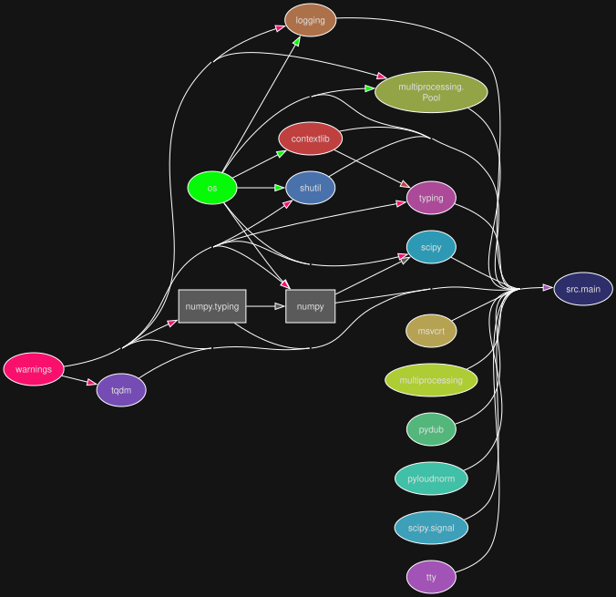

# Python sound optimizer project

<table align="center">
  <tr>
    <td align="center">
        <a href="https://github.com/DariuszMak/sound-optimizer/releases/download/1.0.1/Sound_optimizer.exe">
        
      </a>
    </td>
  </tr>
</table>

### Project structure diagrams

##### Modular perspective

<p align="center">
  
</p>

##### Library dependencies perspective

<p align="center">
  
</p>

## Requirements

- [UV](https://github.com/astral-sh/uv) package manager
- [Task](https://taskfile.dev/docs/installation) runner
- [Ffmpeg](https://github.com/BtbN/FFmpeg-Builds/releases) - install via:

```console
winget install ffmpeg --silent --accept-package-agreements --accept-source-agreements
```

### Fast Windows dev

```console
task full-dev-native ; 
```

### Generate diagrams

```console
task generate-diagrams ; 
```
