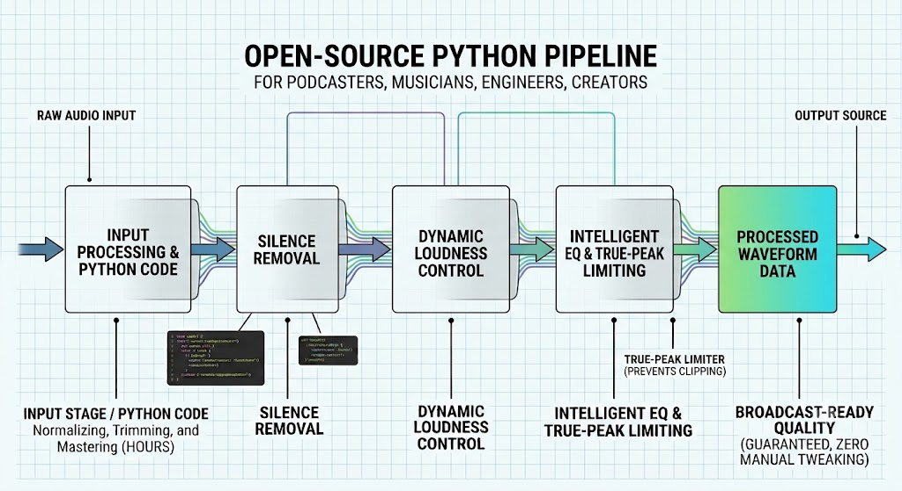
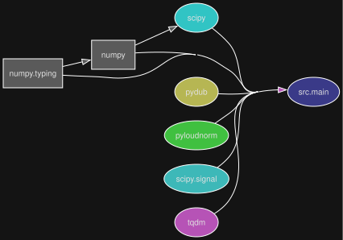
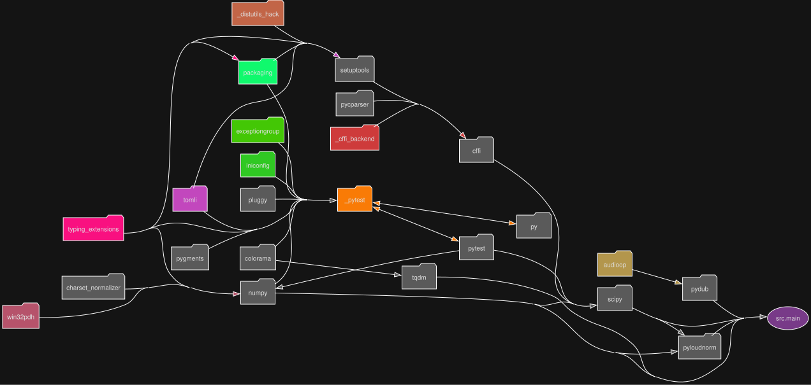

# Python sound optimizer project

<p align="center">
  
</p>

### Project structure diagrams

##### Modular perspective

<p align="center">
  <a href="https://github.com/DariuszMak/sound-optimizer/releases/download/0.6.0/Sound_optimizer.exe">
  
</p>

##### Library dependencies perspective

<p align="center">
  
</p>

## Requirements

- [UV](https://github.com/astral-sh/uv) package manager
- [Task](https://taskfile.dev/docs/installation) runner
- [Ffmpeg](https://github.com/BtbN/FFmpeg-Builds/releases)

### Fast Windows dev

```commandline
task full-dev-native ; 
```

### Generate diagrams

```commandline
task generate-diagrams ; 
```
